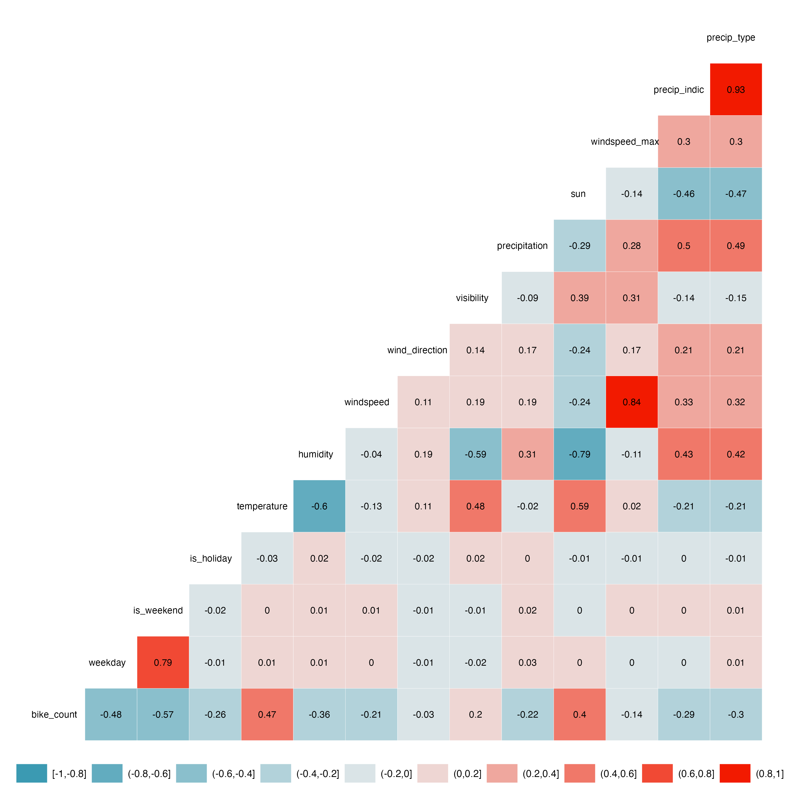
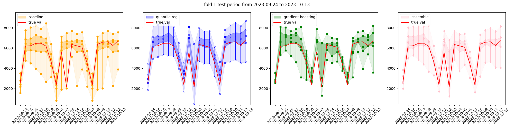

# 2023_11-Karlsruhe-Bicycle-Data

### Summary
This repository focuses on analyzing bicycle data in Karlsruhe, Germany, and includes weather data from the German Weather Service (DWD). The weather data is processed using the rDWD package in R, and the README provides detailed information about the variables, their descriptions, and aggregation methods used.

      

### DWD Weather Variable Aggregation
The table below summarizes the aggregation methods applied to specific DWD variables in the output dataset:

| DWD Variable Name | Variable Name in Output | Aggregation Method |
|----------------------------------|-------------------------------|---------------------------|
| TT_TU.Lufttemperatur             | temperature                   | Mean                      |
| RF_TU.Relative_Feuchte           | humidity                      | Mean                      |
| F.Windgeschwindigkeit            | windspeed                     | Mean                      |
| D.Windrichtung                   | wind_direction                | Mean                      |
| V_VV.Sichtweite                  | visibility                    | Mean                      |
| R1.Niederschlagshoehe            | precipitation                 | Sum                       |
| SD_SO.Sonnenscheindauer          | sun                           | Sum                       |
| FX_911.Windspitze_Stunde1        | windspeed_max                 | Maximum                   |
| RS_IND.Niederschlagsindikator    | precip_indic                  | Median                    |
| WRTR.Niederschlagsform           | precip_type                   | Median                    |
  
### DWD Weather Data Descriptions
Detailed descriptions of the weather variables used in this analysis, including links to their respective description pdfs from official DWD [mirror](https://opendata.dwd.de/climate_environment/CDC/observations_germany/climate/hourly/).

#### Stündliche Stationsmessungen der Lufttemperatur und Luftfeuchte für Deutschland [(doc)](https://opendata.dwd.de/climate_environment/CDC/observations_germany/climate/hourly/air_temperature/BESCHREIBUNG_obsgermany_climate_hourly_air_temperature_de.pdf)

- `TT_TU.Lufttemperatur`: Lufttemperatur in °C 
- `RF_TU.Relative_Feuchte`: relative Feuchte in %

#### Stundenmaximum aus Stationsmessungen der Windgeschwindigkeit für Deutschland [(doc)](https://opendata.dwd.de/climate_environment/CDC/observations_germany/climate/hourly/extreme_wind/BESCHREIBUNG_obsgermany_climate_hourly_extreme_wind_de.pdf)

- `FX_911.Windspitze_Stunde1`: Windgeschwindigkeit, Windspitze in m/s, Fehlwerte=-999

#### Stundenmittel aus Stationsmessungen der Windgeschwindigkeit und Windrichtung für Deutschland [(doc)](https://opendata.dwd.de/climate_environment/CDC/observations_germany/climate/hourly/wind/BESCHREIBUNG_obsgermany_climate_hourly_wind_de.pdf)

- `F.Windgeschwindigkeit`: Windgeschwindigkeit in m/s, Fehlwerte=-999
- `D.Windrichtung`: Windrichtung in °, Fehlwerte=-999

#### Stündliche Stationsmessungen des Niederschlags für Deutschland [(doc)](https://opendata.dwd.de/climate_environment/CDC/observations_germany/climate/hourly/precipitation/BESCHREIBUNG_obsgermany_climate_hourly_precipitation_de.pdf)

- `R1.Niederschlagshoehe`: Niederschlagshoehe in mm (Stundensumme)
- `RS_IND.Niederschlagsindikator`: Indikator Niederschlag, 0=nein, 1=ja, -999=Fehlwert
- `WRTR.Niederschlagsform`:
  - 0 = kein Niederschlag (konventionelle oder automatische Messung)
  - 1 = nur Regen (in historischen Daten vor dem 01.01.1979)
  - 4 = Form des Niederschlags nicht bekannt, obwohl Niederschlag gemeldet; Form fallender und abgesetzter Niederschläge können bei automatischer Messung nicht eindeutig festgestellt werden
  - 6 = nur Regen; flüssiger Niederschlag bei automatischer Messung
  - 7 = nur Schnee; fester Niederschlag bei automatischer Messung
  - 8 = Regen und Schnee und/oder Schneeregen; flüssig und fester Niederschlag bei automatischer Messung
  - 9 = Fehlkennung; fehlender Wert oder Niederschlagsform nicht feststellbar bei automatischer Messung
  - -999 = Fehlwert

#### Stündliche Stationsmessungen der Sonnenscheindauer für Deutschland [(doc)](https://opendata.dwd.de/climate_environment/CDC/observations_germany/climate/hourly/sun/BESCHREIBUNG_obsgermany_climate_hourly_sun_de.pdf)

- `SD_SO.Sonnenscheindauer`: stdl. Sonnenscheindauer in min, Fehlwert = -999 (Stundensumme)

#### Stündliche Stationsmessungen der Sichtweite für Deutschland [(doc)](https://opendata.dwd.de/climate_environment/CDC/observations_germany/climate/hourly/visibility/BESCHREIBUNG_obsgermany_climate_hourly_visibility_de.pdf)

- `V_VV.Sichtweite`: Sichtweite in Metern, Fehlwerte=-999
- `V_VV_I`: Sichtweiten Index, Angabe wie die Messung erfolgte
  - P=Beobachter(Person),I=Instrument, Fehlwerte=-999
- `QN_8`: Qualitaetsniveau
  - QN = 3: automatische Prüfung und Korrektur;
  - QN = 5: historische, subjektive Verfahren;
  - QN = 7: geprüft, gepflegt, nicht korrigiert;

---

**[ 🚧 UNDER CONSTRUCTION ]**

### Update 2024.01.22
applied 3 models
1) **naive benchmark**: using mean of past quantiles with same weekday and month
2) **quantile regression**: based on weather variables, holiday and school holiday dummies + dummies for weekday and month
3) **gradient boosting**: based on weather variables, holiday and school holiday dummies + features: weekday and month

did gridsearch for best params of gradient boosting models for each quantile separately
```
quantile_params = {
    0.025: {'learning_rate': 0.5, 'max_depth': 10, 'min_samples_leaf': 3, 'n_estimators': 400, 'subsample': 0.5},
    0.250: {'learning_rate': 0.2, 'max_depth': 7, 'min_samples_leaf': 3, 'n_estimators': 400, 'subsample': 0.9},
    0.500: {'learning_rate': 0.2, 'max_depth': 5, 'min_samples_leaf': 3, 'n_estimators': 400, 'subsample': 0.9},
    0.750: {'learning_rate': 0.2, 'max_depth': 10, 'min_samples_leaf': 3, 'n_estimators': 400, 'subsample': 0.9},
    0.975: {'learning_rate': 0.5, 'max_depth': 10, 'min_samples_leaf': 3, 'n_estimators': 400, 'subsample': 0.7}}
```

**Evalutation**
- train and test on rolling fcast window (5-fold / rolls) and calculated quantile scores of 3 models and their ensembles
- gradient boosting / ensemble (grad boost + quant reg) seems to perform best based on quantile score

      

| Model               | Fold   | Mean_Quantile_Score | q_score_0.025 | q_score_0.25 | q_score_0.5 | q_score_0.75 | q_score_0.975 |
|---------------------|--------|---------------------|---------------|--------------|-------------|--------------|---------------|
| baseline            | fold_1 | 148.984650          | 60.760219     | 272.906250   | 204.587500  | 168.546875   | 38.122406     |
| baseline            | fold_2 | 390.019113          | 200.778938    | 625.959375   | 648.875000  | 417.828125   | 56.654125     |
| baseline            | fold_3 | 171.524119          | 65.611250     | 200.200000   | 297.475000  | 253.606250   | 40.728094     |
| baseline            | fold_4 | 152.868738          | 60.889813     | 250.984375   | 229.087500  | 190.962500   | 32.419500     |
| baseline            | fold_5 | 340.574856          | 104.876281    | 571.059375   | 590.737500  | 387.062500   | 49.138625     |
| **Average**         | -      | **240.394975**      | **78.783100** | **384.021875** | **374.552500** | **283.005250** | **43.414550** |
| ensemble_all        | fold_1 | 130.161414          | 42.244742     | 147.081017   | 204.644254  | 215.568602   | 41.268457     |
| ensemble_all        | fold_2 | 223.334121          | 74.464679     | 310.892377   | 390.600361  | 296.329252   | 44.383936     |
| ensemble_all        | fold_3 | 101.831542          | 30.919167     | 106.107021   | 174.406498  | 167.185552   | 30.539471     |
| ensemble_all        | fold_4 | 84.691600           | 36.338928     | 144.498476   | 114.616905  | 104.154624   | 23.849069     |
| ensemble_all        | fold_5 | 217.969344          | 57.539700     | 299.963480   | 361.380420  | 302.841387   | 68.121731     |
| **Average**         | -      | **151.197804**      | **48.701843** | **201.108274** | **249.409287** | **197.217083** | **41.832133** |
| ensemble_qr_gb      | fold_1 | 133.537275          | 32.987003     | 127.426254   | 225.352168  | 239.079466   | 42.841482     |
| ensemble_qr_gb      | fold_2 | 155.794254          | 34.662630     | 202.996316   | 266.013041  | 235.579815   | 39.719467     |
| ensemble_qr_gb      | fold_3 | 85.349815           | 18.521140     | 122.607329   | 136.200242  | 123.975203   | 25.445160     |
| ensemble_qr_gb      | fold_4 | 66.326721           | 24.063485     | 109.750436   | 96.698166   | 81.557666    | 19.563853     |
| ensemble_qr_gb      | fold_5 | 195.740182          | 43.230160     | 199.673112   | 304.378609  | 340.745521   | 90.673506     |
| **Average**         | -      | **127.549649**      | **30.492484** | **152.890890** | **205.548045** | **204.394934** | **43.248694** |
| grad_boost           | fold_1 | 135.511058          | 52.808419     | 144.277425   | 220.027978  | 224.997629   | 35.443841     |
| grad_boost           | fold_2 | 160.912358          | 58.654973     | 232.669013   | 239.703904  | 216.641216   | 56.892682     |
| grad_boost           | fold_3 | 95.344042           | 51.022801     | 140.670324   | 151.870993  | 114.444252   | 18.711840     |
| grad_boost           | fold_4 | 69.660172           | 27.580029     | 102.513165   | 102.153703  | 95.294858    | 20.759104     |
| grad_boost           | fold_5 | 200.912017          | 94.908802     | 230.245793   | 248.888966  | 292.977892   | 137.538634    |
| **Average**         | -      | **132.265927**      | **57.994005** | **170.875544** | **192.328309** | **188.671167** | **53.669100** |
| quantile_reg         | fold_1 | 150.416058          | 33.377429     | 130.039297   | 285.263140  | 253.161302   | 50.239123     |
| quantile_reg         | fold_2 | 174.393277          | 75.635190     | 195.689898   | 302.028265  | 254.518415   | 44.094614     |
| quantile_reg         | fold_3 | 97.583743           | 21.098090     | 138.077304   | 140.469102  | 156.095739   | 32.178480     |
| quantile_reg         | fold_4 | 79.539741           | 31.990676     | 127.213391   | 110.393609  | 104.205507   | 23.895521     |
| quantile_reg         | fold_5 | 238.210009          | 36.605980     | 227.909321   | 365.917651  | 423.984187   | 136.632906    |
| **Average**         | -      | **148.228566**      | **39.341273** | **163.785442** | **240.014153** | **238.193430** | **57.408529** |

- based on quantile regression, weather variables with highest explainability are the following
- even though in the correlation plot these are not the weather variables with highest correlation ?

    precip_indic                          -250  
    temperature                             80  
    precipitation                          -55  
    precip_type                            -30  
    windspeed                              -30  
    windspeed_max                          -10  
    humidity                               -10  

    wind_direction                           0  
    visibility                               0  
    sun                                      0  
 
### ToDos 2023.12.01
- Schulferien in Baden Württemberg
- Benchmark Modelle probieren / überlegen / unterschiedliche Komplexitäten etc
- muss noch nicht probabilistisch sein

### Fragen zu R DWD
- was bedeutet KL bei den variabeln? scheint eine Zusammenfassung von mehreren Wetterkennzahlen zu sein?
- schien ganz praktisch zu sein alle variabeln in einem Link zu bekommen ... habe ich benutzt

A: Siehe [Formatbeschreibung](https://opendata.dwd.de/climate_environment/CDC/observations_germany/climate/subdaily/standard_format/formate_kl.html)
MOZ = Mittlere Orts-Zeit

### ToDos 2023.11.03
- API: https://github.com/bundesAPI/eco-visio-api
- Liste der Zählstationen: https://github.com/bundesAPI/eco-visio-api/blob/main/eco-visio-api.csv

- Für Wetter-Daten gibt es das rDWD Paket, das im Wesentlichen ein API zu öffentlich verfügbaren Wetter-Datenbanken des DWD ist.
  - https://bookdown.org/brry/rdwd/
  - https://cran.r-project.org/web/packages/rdwd/index.html
 
- Die Wetterstation nahe Karlsruhe ist [Rheinstetten](https://www.dwd.de/DE/wetter/wetterundklima_vorort/baden-wuerttemberg/rheinstetten/_node.html), findest du vermutlich über den Namen.
  - [Alle Stationen für Lufttemperatur zB](https://opendata.dwd.de/climate_environment/CDC/observations_germany/climate/hourly/air_temperature/recent/TU_Stundenwerte_Beschreibung_Stationen.txt) Identifier sollte 04177 sein

- Die Rohdaten gibt es theoretisch auch über z.B: [LINK](https://opendata.dwd.de/climate_environment/CDC/observations_germany/climate/hourly/air_temperature/recent/), aber das rDWD Paket ist sicher die einfachere Zugriffsmöglichkeit darauf
- Die Daten sind vermutlich in stündlicher Auflösung und müssten zu tageweisen Daten aggregiert werden (z.B. Summe Niederschlag, Durchschnitts- / Maximum- Temperatur und Windgeschwindigkeit, Sonnenscheindauer,
