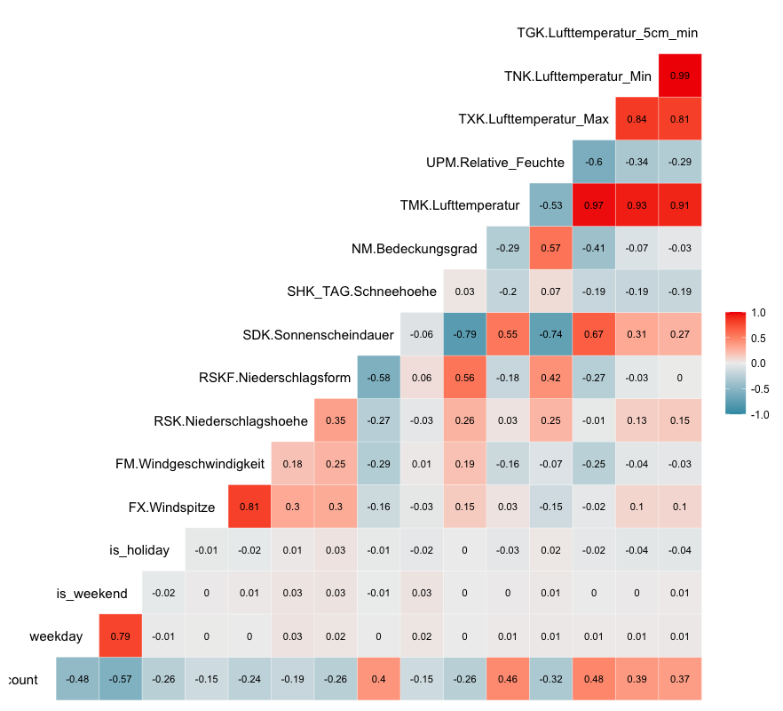

# 2023_11-Karlsruhe-Bicycle-Data

---

| DWD Variable Name | Variable Name in Output | Aggregation Method |
|----------------------------------|-------------------------------|---------------------------|
| TT_TU.Lufttemperatur             | temperature                   | Mean                      |
| RF_TU.Relative_Feuchte           | humidity                      | Mean                      |
| F.Windgeschwindigkeit            | windspeed                     | Mean                      |
| D.Windrichtung                   | wind_direction                | Mean                      |
| V_VV.Sichtweite                  | visibility                    | Mean                      |
| R1.Niederschlagshoehe            | precipitation                 | Sum                       |
| SD_SO.Sonnenscheindauer          | sun                           | Sum                       |
| FX_911.Windspitze_Stunde1        | windspeed_max                 | Maximum                   |
| RS_IND.Niederschlagsindikator    | precip_indic                  | Median                    |
| WRTR.Niederschlagsform           | precip_type                   | Median                    |

### Wetterdaten - DWD Variable Descriptions [(all docs from DWD)](https://opendata.dwd.de/climate_environment/CDC/observations_germany/climate/hourly/)

[Stündliche Stationsmessungen der Lufttemperatur und Luftfeuchte für Deutschland](https://opendata.dwd.de/climate_environment/CDC/observations_germany/climate/hourly/air_temperature/BESCHREIBUNG_obsgermany_climate_hourly_air_temperature_de.pdf)

- `TT_TU.Lufttemperatur`: Lufttemperatur in °C 
- `RF_TU.Relative_Feuchte`: relative Feuchte in %

[Stundenmaximum aus Stationsmessungen der Windgeschwindigkeit für Deutschland ](https://opendata.dwd.de/climate_environment/CDC/observations_germany/climate/hourly/extreme_wind/BESCHREIBUNG_obsgermany_climate_hourly_extreme_wind_de.pdf)

- `FX_911.Windspitze_Stunde1`: Windgeschwindigkeit, Windspitze in m/s, Fehlwerte=-999

[Stundenmittel aus Stationsmessungen der Windgeschwindigkeit und Windrichtung für Deutschland ](https://opendata.dwd.de/climate_environment/CDC/observations_germany/climate/hourly/wind/BESCHREIBUNG_obsgermany_climate_hourly_wind_de.pdf)

- `F.Windgeschwindigkeit`: Windgeschwindigkeit in m/s, Fehlwerte=-999
- `D.Windrichtung`: Windrichtung in °, Fehlwerte=-999

[Stündliche Stationsmessungen des Niederschlags für Deutschland ](https://opendata.dwd.de/climate_environment/CDC/observations_germany/climate/hourly/precipitation/BESCHREIBUNG_obsgermany_climate_hourly_precipitation_de.pdf)

- `R1.Niederschlagshoehe`: Niederschlagshoehe in mm (Stundensumme)
- `RS_IND.Niederschlagsindikator`: Indikator Niederschlag, 0=nein, 1=ja, -999=Fehlwert
- `WRTR.Niederschlagsform`:
  - 0 = kein Niederschlag (konventionelle oder automatische Messung)
  - 1 = nur Regen (in historischen Daten vor dem 01.01.1979)
  - 4 = Form des Niederschlags nicht bekannt, obwohl Niederschlag gemeldet; Form fallender und abgesetzter Niederschläge können bei automatischer Messung nicht eindeutig festgestellt werden
  - 6 = nur Regen; flüssiger Niederschlag bei automatischer Messung
  - 7 = nur Schnee; fester Niederschlag bei automatischer Messung
  - 8 = Regen und Schnee und/oder Schneeregen; flüssig und fester Niederschlag bei automatischer Messung
  - 9 = Fehlkennung; fehlender Wert oder Niederschlagsform nicht feststellbar bei automatischer Messung
  - -999 = Fehlwert

[Stündliche Stationsmessungen der Sonnenscheindauer für Deutschland ](https://opendata.dwd.de/climate_environment/CDC/observations_germany/climate/hourly/sun/BESCHREIBUNG_obsgermany_climate_hourly_sun_de.pdf)

- `SD_SO.Sonnenscheindauer`: stdl. Sonnenscheindauer in min, Fehlwert = -999 (Stundensumme)

[Stündliche Stationsmessungen der Sichtweite für Deutschland ](https://opendata.dwd.de/climate_environment/CDC/observations_germany/climate/hourly/visibility/BESCHREIBUNG_obsgermany_climate_hourly_visibility_de.pdf)

- `V_VV.Sichtweite`: Sichtweite in Metern, Fehlwerte=-999
- `V_VV_I`: Sichtweiten Index, Angabe wie die Messung erfolgte
  - P=Beobachter(Person),I=Instrument, Fehlwerte=-999
- `QN_8`: Qualitaetsniveau
  - QN = 3: automatische Prüfung und Korrektur;
  - QN = 5: historische, subjektive Verfahren;
  - QN = 7: geprüft, gepflegt, nicht korrigiert;

### Corr Plot

### Fragen zu R DWD
- was bedeutet KL bei den variabeln? scheint eine Zusammenfassung von mehreren Wetterkennzahlen zu sein?
- schien ganz praktisch zu sein alle variabeln in einem Link zu bekommen ... habe ich benutzt

A: Siehe [Formatbeschreibung](https://opendata.dwd.de/climate_environment/CDC/observations_germany/climate/subdaily/standard_format/formate_kl.html)
MOZ = Mittlere Orts-Zeit

---

### ToDos 2023.11.03
- API: https://github.com/bundesAPI/eco-visio-api
- Liste der Zählstationen: https://github.com/bundesAPI/eco-visio-api/blob/main/eco-visio-api.csv

- Für Wetter-Daten gibt es das rDWD Paket, das im Wesentlichen ein API zu öffentlich verfügbaren Wetter-Datenbanken des DWD ist.
  - https://bookdown.org/brry/rdwd/
  - https://cran.r-project.org/web/packages/rdwd/index.html
 
- Die Wetterstation nahe Karlsruhe ist [Rheinstetten](https://www.dwd.de/DE/wetter/wetterundklima_vorort/baden-wuerttemberg/rheinstetten/_node.html), findest du vermutlich über den Namen.
  - [Alle Stationen für Lufttemperatur zB](https://opendata.dwd.de/climate_environment/CDC/observations_germany/climate/hourly/air_temperature/recent/TU_Stundenwerte_Beschreibung_Stationen.txt) Identifier sollte 04177 sein

- Die Rohdaten gibt es theoretisch auch über z.B: [LINK](https://opendata.dwd.de/climate_environment/CDC/observations_germany/climate/hourly/air_temperature/recent/), aber das rDWD Paket ist sicher die einfachere Zugriffsmöglichkeit darauf
- Die Daten sind vermutlich in stündlicher Auflösung und müssten zu tageweisen Daten aggregiert werden (z.B. Summe Niederschlag, Durchschnitts- / Maximum- Temperatur und Windgeschwindigkeit, Sonnenscheindauer,
